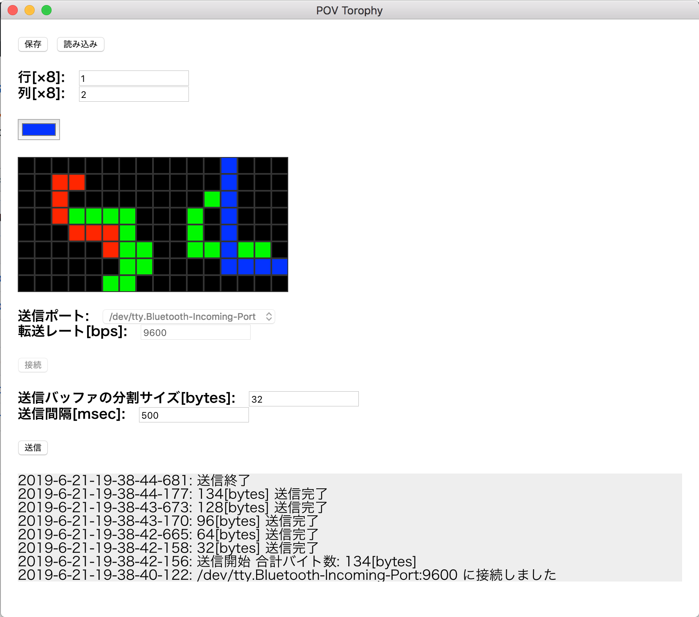

# PovTorophy



## ビルドのしかた

node modules をインストール

```sh
$ yarn
```

ビルドする

```sh
$ ./build.sh
```

## 開発の仕方

node modules をインストール

```sh
$ yarn
```

ファイルの watch

```sh
$ yarn watch
```

electron を起動

```sh
$ yarn start
```

## 送信するデータの形式

| バイト数 | 中身 |
|---|---|
| 4バイト| ヘッダ 0xC0, 0xFF, 0xEE, 0x11 |
| 1バイト| 行数 |
| 1バイト| 列数 |
| 1バイト * （列数 * 行数）| RGBのデータ （0b00000{R}{G}{B}）|
